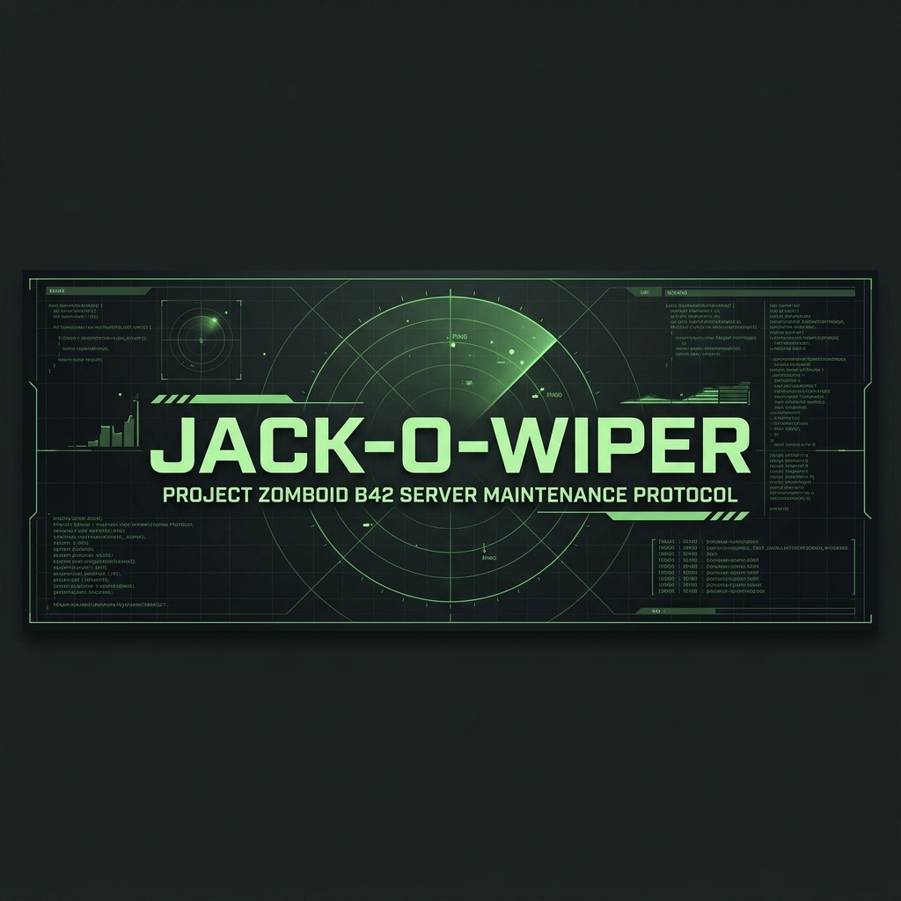

<div align="center">
  
  <br><br>

  <h1>JACK-O-WIPER</h1>
  <p><b>[SISTEMA] PROTOCOLO DE MANTENIMIENTO PARA SERVIDORES PROJECT ZOMBOID B42</b></p>

  <p>
    <a href="LICENSE">
      
    </a>
    
    
  </p>
</div>

---

## [ ESTADO: ACTIVO ] VISIÓN GENERAL

**Jack-o-Wiper** es un conjunto de herramientas robusto basado en terminal para el mantenimiento y borrado (wipe) de mundos, diseñado específicamente para **Project Zomboid Build 42**. Opera manipulando directamente los archivos binarios `.bin` y las bases de datos SQLite generadas por el servidor.

Está diseñado para automatizar el proceso de reiniciar un mapa multijugador mientras preserva de forma segura la progresión de los jugadores, las bases de datos de whitelist, los refugios (safehouses) construidos y los estados dinámicos del mundo.

---

## [ DIRECTIVAS PRINCIPALES ] CARACTERÍSTICAS

*   **[ 1 ] WIPE COMPLETO**: Purga todos los chunks del mapa, binarios generados del mundo y sistemas de la B42 (`map_fluid.bin`, `map_electricity.bin`). Preserva de forma segura `players.db`, `vehicles.db` y `servertest.db`.
*   **[ 2 ] WIPE PARCIAL**: Conserva el directorio `map_visited_server`, evitando que los jugadores pierdan su mapa explorado (niebla de guerra).
*   **[ 3 ] WIPE SELECTIVO (PRESERVACIÓN DE REFUGIOS)**: Identifica las bases de los jugadores mediante rangos de coordenadas, marcas de tiempo o analizando directamente el binario interno `map_meta.bin` y `players.db`. Protege estos chunks del protocolo de purga.
*   **[ 4 ] RESPALDO AISLADO**: Genera copias de seguridad comprimidas y con marca de tiempo de los directorios `save/`, `db/` y la configuración `Server/`.
*   **[ 5 ] MOTOR ANTI-AMNESIA B42**: Consciente de los cambios de la B42. Reconstruye `SandboxVars.lua` automáticamente si el servidor intenta sobrescribir la configuración personalizada al generar el mundo.

---

## [ DESPLIEGUE ] INSTALACIÓN Y USO

### LINUX (ENTORNO NATIVO)

1. Clona o descarga el repositorio en el directorio del usuario de tu servidor.
2. Otorga permisos de ejecución:
   ```bash
   chmod +x pz_wipe.sh pz_coords.sh
   ```
3. Abre `pz_wipe.sh` y edita el bloque de configuración en la parte superior para que coincida con las rutas de tu despliegue:
   ```bash
   PZ_BASE_DIR="/home/steam/Zomboid"
   SERVER_NAME="servertest"
   ```
4. Ejecuta el protocolo:
   ```bash
   ./pz_wipe.sh
   ```

### WINDOWS (VÍA GIT BASH)

Aunque está escrito en Bash para asegurar la máxima velocidad y compatibilidad con utilidades de Unix (`xargs`, `find`), Jack-o-Wiper puede ejecutarse sin problemas en despliegues de Windows Server.

1. **Instala Git para Windows**: Descarga e instala [Git](https://git-scm.com/download/win). Esto incluye **Git Bash**, un entorno de terminal similar a Unix.
2. Abre el archivo `pz_wipe.sh` con cualquier editor de texto (como Notepad++).
3. Modifica el `PZ_BASE_DIR` para que apunte a tu ruta de Zomboid en Windows usando barras diagonales (`/`) al estilo Unix.
   * *Ejemplo*: Si tu partida guardada está en `C:\Users\Admin\Zomboid`, cámbialo a:
     ```bash
     PZ_BASE_DIR="/c/Users/Admin/Zomboid"
     ```
4. Haz clic derecho dentro de tu carpeta y selecciona **"Open Git Bash here"** (Abrir Git Bash aquí).
5. Ejecuta el script:
   ```bash
   ./pz_wipe.sh
   ```

> [!WARNING]
> NO uses el Símbolo del Sistema estándar de Windows (`cmd.exe`) ni PowerShell para ejecutar este script. Requiere el entorno Git Bash para analizar los archivos binarios y ejecutar los comandos de limpieza correctamente.

---

## [ PROTOCOLO INTERNO ] ANÁLISIS DE REFUGIOS

Jack-o-Wiper utiliza un módulo Python incrustado (`pz_safehouse_parser.py`) para extraer las geometrías de los refugios directamente del binario `map_meta.bin` de la B42.
Si Python 3 está instalado en el entorno, el modo de wipe selectivo detectará automáticamente los refugios activos y protegerá sus correspondientes chunks de mapa sin requerir la introducción manual de coordenadas.

---

## [ AUTORIZACIÓN ] LICENCIA

Este software se publica bajo la **Licencia MIT**.
Consulta el archivo `LICENSE` para conocer los términos completos y los permisos operativos.
