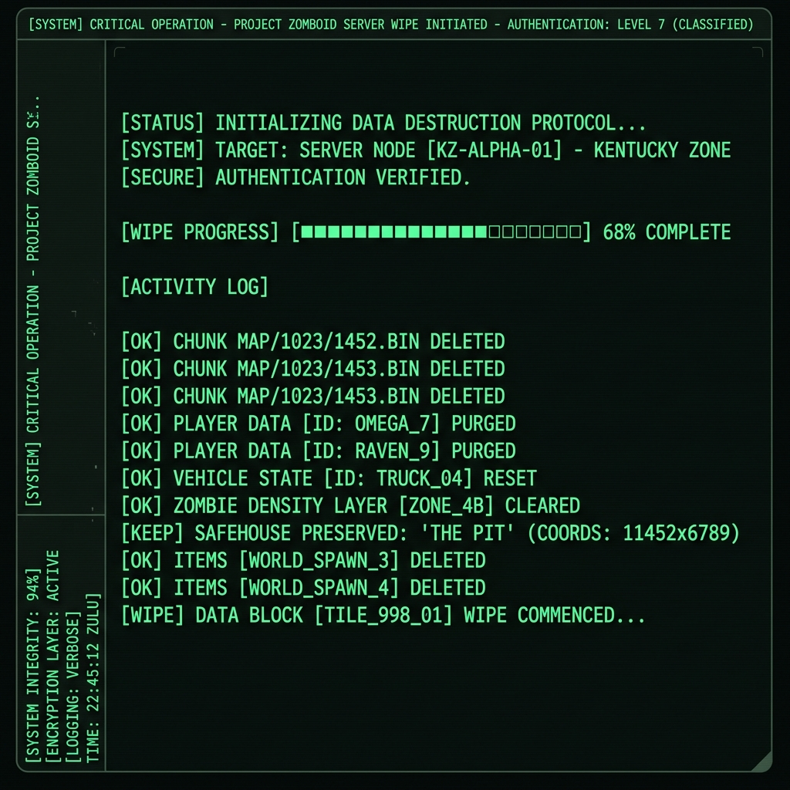

<div align="center">
  
  <br><br>

  <h1>JACK-O-WIPER</h1>
  <p><b>[SYSTEM] PROJECT ZOMBOID B42 SERVER MAINTENANCE PROTOCOL</b></p>

  <p>
    <a href="LICENSE">
      
    </a>
    
    
  </p>
</div>

---

## [ STATUS: ACTIVE ] OVERVIEW

**Jack-o-Wiper** is a robust, terminal-based world wiping and maintenance toolkit specifically engineered for **Project Zomboid Build 42**. It operates by directly manipulating the binary `.bin` files and SQLite databases generated by the server.

It is designed to automate the painful process of resetting a multiplayer map while safely preserving player progression, whitelist databases, built safehouses, and dynamic world states.

<div align="center">
  
</div>

---

## [ CORE DIRECTIVES ] FEATURES

*   **[ 1 ] COMPLETE WIPE**: Purges all map chunks, world generated binaries, and B42 systems (`map_fluid.bin`, `map_electricity.bin`). Safely preserves `players.db`, `vehicles.db`, and `servertest.db`.
*   **[ 2 ] PARTIAL WIPE**: Retains the `map_visited_server` directory, preventing players from losing their explored map fog-of-war.
*   **[ 3 ] SELECTIVE WIPE (SAFEHOUSE PRESERVATION)**: Identifies player bases via coordinate ranges, timestamps, or by directly parsing the internal `map_meta.bin` and `players.db`. It shields these chunks from the purge protocol.
*   **[ 4 ] ISOLATED BACKUP**: Generates compressed, timestamped backups of the `save/`, `db/`, and `Server/` configuration directories.
*   **[ 5 ] ANTI-AMNESIA B42 ENGINE**: Aware of B42 changes. Rebuilds `SandboxVars.lua` automatically if the server attempts to overwrite custom settings upon world generation.

---

## [ DEPLOYMENT ] INSTALLATION & USAGE

### LINUX (NATIVE ENVIRONMENT)

1. Clone or download the repository into your server user's directory.
2. Grant execution permissions:
   ```bash
   chmod +x pz_wipe.sh pz_coords.sh
   ```
3. Open `pz_wipe.sh` and edit the configuration block at the top to match your deployment paths:
   ```bash
   PZ_BASE_DIR="/home/steam/Zomboid"
   SERVER_NAME="servertest"
   ```
4. Execute the protocol:
   ```bash
   ./pz_wipe.sh
   ```

### WINDOWS (VIA GIT BASH)

Although written in Bash to ensure maximum speed and compatibility with Unix utilities (`xargs`, `find`), Jack-o-Wiper can run flawlessly on Windows Server deployments.

1. **Install Git for Windows**: Download and install [Git](https://git-scm.com/download/win). This includes **Git Bash**, a Unix-like terminal environment.
2. Open the `pz_wipe.sh` file with any text editor (like Notepad++).
3. Modify the `PZ_BASE_DIR` to point to your Windows Zomboid path using Unix-style forward slashes.
   * *Example*: If your save is in `C:\Users\Admin\Zomboid`, change it to:
     ```bash
     PZ_BASE_DIR="/c/Users/Admin/Zomboid"
     ```
4. Right-click inside your folder and select **"Open Git Bash here"**.
5. Run the script:
   ```bash
   ./pz_wipe.sh
   ```

> [!WARNING]
> DO NOT use the standard Windows Command Prompt (`cmd.exe`) or PowerShell to run this script. It requires the Git Bash environment to parse the binary files and execute the cleanup commands correctly.

---

## [ INTERNAL PROTOCOL ] SAFEHOUSE PARSING

Jack-o-Wiper utilizes an embedded Python module (`pz_safehouse_parser.py`) to extract safehouse geometries directly from the B42 `map_meta.bin` binary.
If Python 3 is installed in the environment, the selective wipe mode will automatically detect active safehouses and protect their corresponding map chunks without requiring manual coordinate entry.

---

## [ CLEARANCE ] LICENSE

This software is released under the **MIT License**.
Refer to the `LICENSE` file for full terms and operational permissions.
